### 2D Feature Tracking in Camera Images for Sensor Fusion

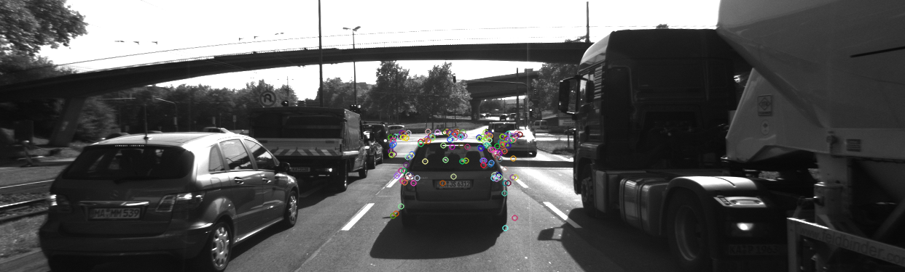

## Goal
The goal of this project is to build a collision detection system.  I have built the feature tracking part and test various detector / descriptor combinations to see which ones perform best. 

## Introduction


## Data Buffer Optimization (MP 1)
Since computer vision algorithms will be deployed in mobile hardware with limited resources, optimizing  the amount of data held in memory is of significant importance. For this purpose, i have implemented a data buffer modeled based on Queue data structure. Here the first image to enter will also leave first to accommodate next image and maintain a constant queue size, in this case 2.

```
        DataFrame frame;
        frame.cameraImg = imgGray;
        frame.imgName = imgFullFilename;
        if (dataBuffer.size() >= dataBufferSize){
            dataBuffer.erase(dataBuffer.begin());
        }
        dataBuffer.push_back(frame);
```
## Keypoint Detection Algorithm Selection (MP 2)
The computer vision library provides various algorithms to detect keypoint in images. I have selected and tested following algorithms. Harris, Shi-Tomasi, FAST, ORB, AKAZE and SIFT. 

I have developed dual mode to run my program. If the variable is_single_run is set to true, then values set to the string det_type and des_type will be considered. If the value of is_single_run is false, then all combination of detection and descriptor types will used and performance analysis will be conducted. Please set the variable to true, if you want to use your own combination
```
    bool is_single_run = true;
    string det_type = "FAST"; // Detector Type
    string des_type = "ORB";// Descriptor Type
```

The string det_type and des_type are checked if their values matches anyone of the algorithms is implemented and the corresponding call is made.

```
 if (detectorType.compare("SHITOMASI") == 0)
        {
            detKeypointsShiTomasi(keypoints, imgGray, false,ctime_detection);
        }
        else if(detectorType.compare("HARRIS") == 0)
        {
            detKeypointsHarris(keypoints, imgGray, false,ctime_detection);
        }
        else if( (detectorType.compare("FAST") == 0) || (detectorType.compare("BRISK") == 0) || (detectorType.compare("ORB") == 0) || (detectorType.compare("AKAZE") == 0) || (detectorType.compare("SIFT") == 0) )
        {
            detKeypointsModern(keypoints, imgGray,detectorType, false,ctime_detection);
        }
```
While Shi-Tomasi and Harris have their own function calls, other algortihms are clustered into a single function call detKeypointsModern(). The function is implemented in matching2D_Student.cpp. Inside this function, corresponding call to respective algorithms are made as shown below. 

```
 if (detectorType.compare("FAST") == 0){

        t = (double)cv::getTickCount();
        cv::Ptr<cv::FastFeatureDetector> fast_detect = cv::FastFeatureDetector::create(30,true);
        fast_detect->detect(img,keypoints);
        t = ((double)cv::getTickCount() - t) / cv::getTickFrequency();
        cout << "FAST detection with n=" << keypoints.size() << " keypoints in " << 1000 * t / 1.0 << " ms" << endl;

    }

    else if (detectorType.compare("BRISK") == 0){

        t = (double)cv::getTickCount();
        cv::Ptr<cv::FeatureDetector> detector = cv::BRISK::create();
        detector->detect(img,keypoints);
        t = ((double)cv::getTickCount() - t) / cv::getTickFrequency();
        cout << "BRISK detection with n=" << keypoints.size() << " keypoints in " << 1000 * t / 1.0 << " ms" << endl;

    }

    else if (detectorType.compare("ORB") == 0){

        t = (double)cv::getTickCount();
        cv::Ptr<cv::FeatureDetector> detector = cv::ORB::create();
        detector->detect(img,keypoints);
        t = ((double)cv::getTickCount() - t) / cv::getTickFrequency();
        cout << "ORB detection with n=" << keypoints.size() << " keypoints in " << 1000 * t / 1.0 << " ms" << endl;

    }

    else if (detectorType.compare("AKAZE") == 0){

        t = (double)cv::getTickCount();
        cv::Ptr<cv::FeatureDetector> detector = cv::AKAZE::create();
        detector->detect(img,keypoints);
        t = ((double)cv::getTickCount() - t) / cv::getTickFrequency();
        cout << "AKAZE detection with n=" << keypoints.size() << " keypoints in " << 1000 * t / 1.0 << " ms" << endl;

    }
    else if (detectorType.compare("SURF") == 0){


        int minHessian=400;
        t = (double)cv::getTickCount();
        cv::Ptr<cv::FeatureDetector> detector = cv::xfeatures2d::SURF::create(minHessian);
        detector->detect(img,keypoints);
        t = ((double)cv::getTickCount() - t) / cv::getTickFrequency();
        cout << "SURF detection with n=" << keypoints.size() << " keypoints in " << 1000 * t / 1.0 << " ms" << endl;

    }
    else if (detectorType.compare("SIFT") == 0){

        t = (double)cv::getTickCount();
        cv::Ptr<cv::FeatureDetector> detector = cv::xfeatures2d::SIFT::create();
        detector->detect(img,keypoints);
        t = ((double)cv::getTickCount() - t) / cv::getTickFrequency();
        cout << "SIFT detection with n=" << keypoints.size() << " keypoints in " << 1000 * t / 1.0 << " ms" << endl;
    }

```

## Keypoint Removal (MP 3)
Since project scope is restricted to detecting the vehicle at the front, the keypoints detected on front vehicles are alone considered for further processing. The variable bFocusOnVehicle should be set to true for keypoint restriction on Front vehicle. The bounding box for front vehicle is provided by the cv::Rect(). By looping through all all the detected keypoints and adding only the ones which fall into the box into a fresh vector, the keypoints are seperated. The inbuilt function of cv::Rect contains() can also be used to check if the keypoints fall into bounding box. Here , i have checked it manually.
```
        bool bFocusOnVehicle = true;
        cv::Rect vehicleRect(535, 180, 180, 150);
        if (bFocusOnVehicle)
        {
            vector<cv::KeyPoint> filteredPts;
            float a = vehicleRect.x;
            for (cv::KeyPoint kp:keypoints){
                if ( ( (kp.pt.x > vehicleRect.x ) && (kp.pt.x < ( vehicleRect.x + vehicleRect.width ) ) ) && ( (kp.pt.y > vehicleRect.y ) && (kp.pt.y < ( vehicleRect.y + vehicleRect.height ) ) ) ){
                    filteredPts.push_back(kp);
                }
                
                
            }
            keypoints = filteredPts;
            cout << " NOTE: Keypoints Restricted to box of preceding vehicle!" << keypoints.size()<<endl;
        }
```

## Keypoint Descriptors (MP 4)
Keypoint descriptor algorithms like BRISK, ORB, FREAK, AKAZE and SIFT are implemented in this project.  However some descriptors work only with a specfic detector. In the combination availabe in this project, AKAZE descriptor can only work with keypoint detected by AKAZE detector. Similairy , ORB descriptor will not work with SIFT Keypoints. These restrictions are also coded in this project. The function calls to respective descriptor is made based on the string value des_type. 

A general function call is made in MidTermProject_Camera_Student.cpp by passing the keypoints detected, image, descriptor type to be used. The extracted descriptor and the time taken to execute the extraction process, is then returned back via references to descriptors and ctime_desextract. The descriptor is then assigned to the last DataFrame
```
descKeypoints((dataBuffer.end() - 1)->keypoints, (dataBuffer.end() - 1)->cameraImg, descriptors, descriptorType,ctime_desextract);

(dataBuffer.end() - 1)->descriptors = descriptors;
```
In the matching2D_Student.cpp, the function to select the right extractor and execution is coded. Finally , the descriptor and the execution time is passed back as reference.

```
 cv::Ptr<cv::DescriptorExtractor> extractor;
    if (descriptorType.compare("BRISK") == 0)
    {

        int threshold = 30;        // FAST/AGAST detection threshold score.
        int octaves = 3;           // detection octaves (use 0 to do single scale)
        float patternScale = 1.0f; // apply this scale to the pattern used for sampling the neighbourhood of a keypoint.

        extractor = cv::BRISK::create(threshold, octaves, patternScale);
    }
    else if (descriptorType.compare("BRIEF") == 0)
    {
        extractor = cv::xfeatures2d::BriefDescriptorExtractor::create();
        //extractor->compute(img,keypoints,descriptors);
        
    }
    else if (descriptorType.compare("ORB") == 0)
    {
        extractor = cv::ORB::create();
        //extractor->compute(img,keypoints,descriptors);
        
    }

    else if (descriptorType.compare("FREAK") == 0)
    {
        extractor = cv::xfeatures2d::FREAK::create();
        //extractor->compute(img,keypoints,descriptors);
        
    }
    else if (descriptorType.compare("AKAZE") == 0)
    {
        extractor = cv::AKAZE::create();
        //extractor->compute(img,keypoints,descriptors);
        
    }
    else if (descriptorType.compare("SIFT") == 0)
    {
        extractor = cv::xfeatures2d::SIFT::create();
        //extractor->compute(img,keypoints,descriptors);
        
    }

    // perform feature description
    double t = (double)cv::getTickCount();
    extractor->compute(img, keypoints, descriptors);
    t = ((double)cv::getTickCount() - t) / cv::getTickFrequency();
    compute_time = t * 1000 / 1.0;
    cout << descriptorType << " descriptor extraction in " << 1000 * t / 1.0 << " ms" << endl;

```

## Descriptor Matching and Descriptor Ratio (MP 5 / 6)

The type of matcher to be used is available in string matcherType. Brute Force matching and FLANN matching are implemented. The selector type is decided by the variable selectorType. Availabe options here are Nearest neighbour (SEL_NN) and k-nearest neighbour (SEL_KNN). Descriptor Type is required to set if binary descriptor or HOG (Histogram of Gradients) descripor is used. In this project, SIFT is HOG based descriptor.
```
            string matcherType = "MAT_BF";        // MAT_BF, MAT_FLANN
            string selectorType = "SEL_KNN";       // SEL_NN, SEL_KNN
            string descriptorType = descriptor_class[desIndex]; // DES_BINARY, DES_HOG
```

In the matching2D_Student.cpp, the function matchDescriptors implements the matching process. The matcherType is first selected. For  Brute Force matching, default distance normaliser Hamming is used. However for HOG descriptor, L2 normalisation is used. The respective call to either Nearest Neighbour or K- Nearest Neighbour is used with fixed value of 2 neighbours. The ratio threshold of 0.8 is used to choose a match.

```
bool crossCheck = false;
    cv::Ptr<cv::DescriptorMatcher> matcher;

    if (matcherType.compare("MAT_BF") == 0)
    {
        int normType = cv::NORM_HAMMING;
        
        if (descriptorType=="DES_HOG"){
            normType = cv::NORM_L2;
            cout<<"switching to L2_NORM for "<< descriptorType<<endl;

        }
            
        matcher = cv::BFMatcher::create(normType, crossCheck);
    }
    else if (matcherType.compare("MAT_FLANN") == 0)
    {
        if ( descSource.type() != CV_32F ){
            descSource.convertTo(descSource,CV_32F);
            descRef.convertTo(descRef,CV_32F);
        }
        matcher = cv::FlannBasedMatcher::create();
    }

    // perform matching task
    if (selectorType.compare("SEL_NN") == 0)
    { // nearest neighbor (best match)

        matcher->match(descSource, descRef, matches); // Finds the best match for each descriptor in desc1
    }
    else if (selectorType.compare("SEL_KNN") == 0)
    { // k nearest neighbors (k=2)
        vector<vector<cv::DMatch>> knn_matches;
        matcher->knnMatch(descSource, descRef, knn_matches,2);


        const float ratio_threshold=0.8f;
        for ( size_t i=0; i<knn_matches.size();i++){
            float ratio = knn_matches[i][0].distance / knn_matches[i][1].distance;
            if ( ratio < ratio_threshold )
                matches.push_back(knn_matches[i][0]);

        }
        
    }
```

## Keypoint size and distribution for all detectors (MP 7)


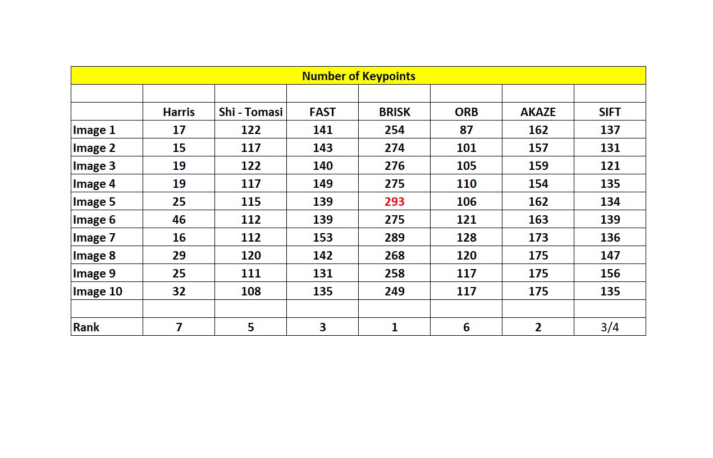

As seen from the statistics , BRISK detector detects the maximum number of keypoints. AKAZE and FAST detects 
in the next maximum number of keypoints.

Keypoints detected by Harris detector
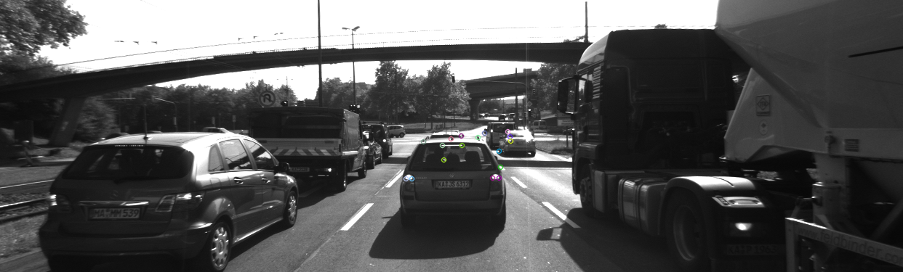

Keypoints detected by Shi Tomasi detector
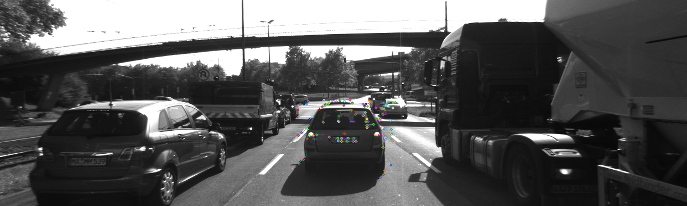

Keypoints detected by FAST detector


Keypoints detected by BRISK detector
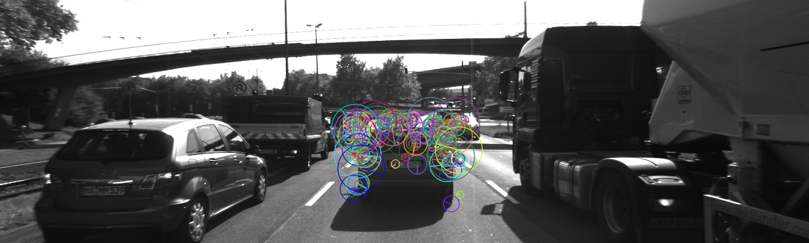

Keypoints detected by ORB detector
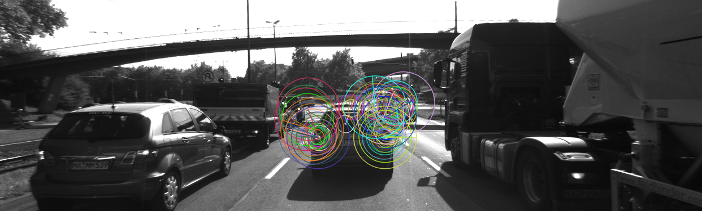

Keypoints detected by AKAZE detector
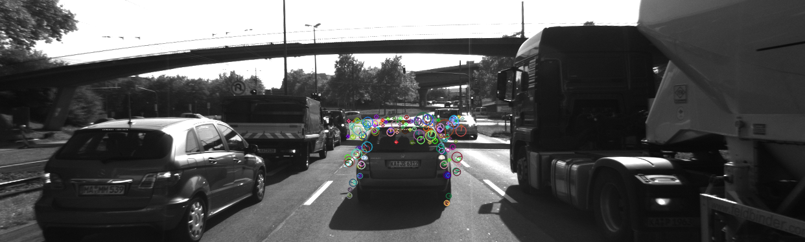

Keypoints detected by SIFT detector
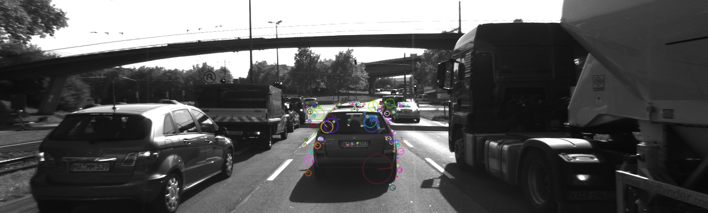

## Keypoints macthes for all detector / descriptor combination (MP 8)

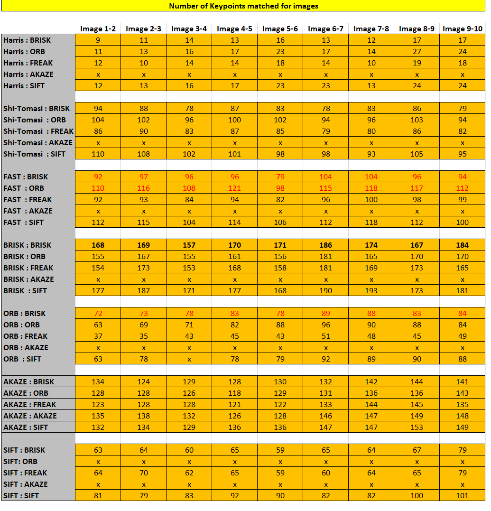

## Computation time for detector / descriptor combination (MP 9)

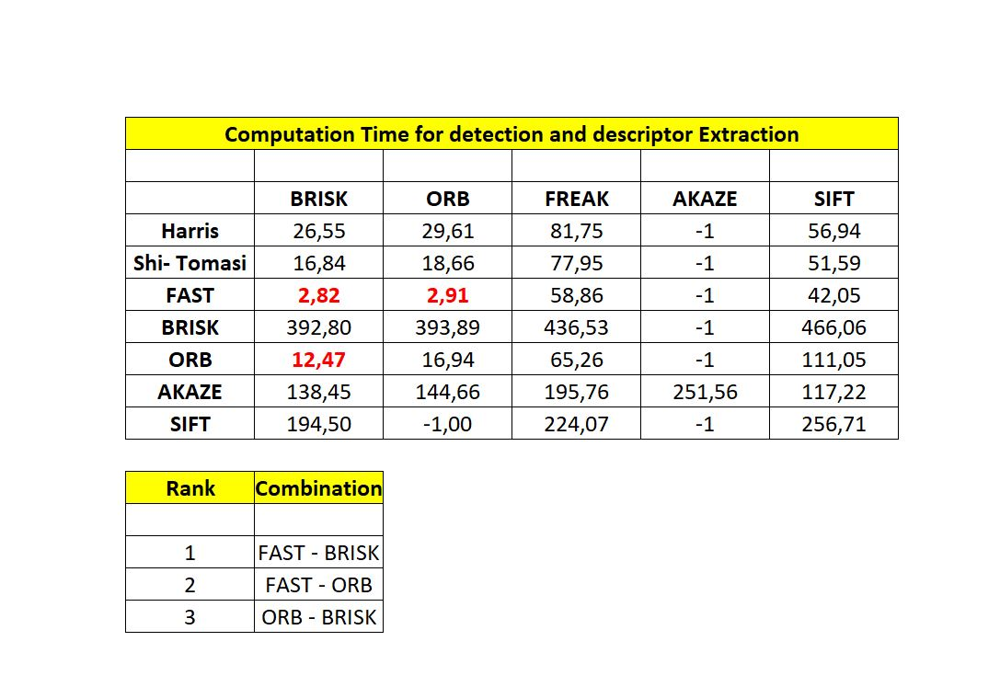

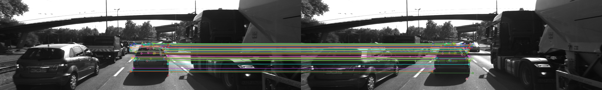
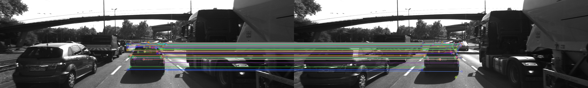
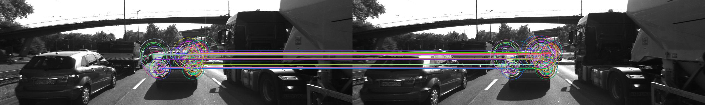


## Dependencies for Running Locally
* cmake >= 2.8
  * All OSes: [click here for installation instructions](https://cmake.org/install/)
* make >= 4.1 (Linux, Mac), 3.81 (Windows)
  * Linux: make is installed by default on most Linux distros
  * Mac: [install Xcode command line tools to get make](https://developer.apple.com/xcode/features/)
  * Windows: [Click here for installation instructions](http://gnuwin32.sourceforge.net/packages/make.htm)
* OpenCV >= 4.1
  * This must be compiled from source using the `-D OPENCV_ENABLE_NONFREE=ON` cmake flag for testing the SIFT and SURF detectors.
  * The OpenCV 4.1.0 source code can be found [here](https://github.com/opencv/opencv/tree/4.1.0)
* gcc/g++ >= 5.4
  * Linux: gcc / g++ is installed by default on most Linux distros
  * Mac: same deal as make - [install Xcode command line tools](https://developer.apple.com/xcode/features/)
  * Windows: recommend using [MinGW](http://www.mingw.org/)

## Basic Build Instructions

1. Clone this repo.
2. Make a build directory in the top level directory: `mkdir build && cd build`
3. Compile: `cmake .. && make`
4. Run it: `./2D_feature_tracking`.
